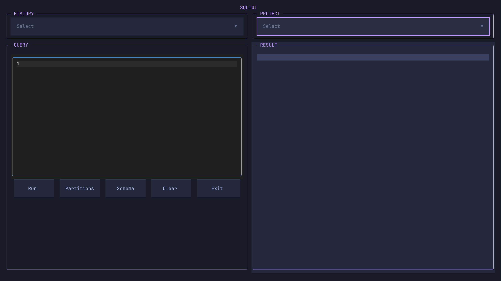

# SQLTUI

SQLTUI is a Terminal User Interface (TUI) for executing SQL queries against Alibaba Cloud MaxCompute (ODPS). Built with [Textual](https://textual.textualize.io/), it provides a modern interface for data exploration directly from your terminal.



## Features

- **SQL Editor**: Syntax highlighting for SQL queries.
- **Multi-Project Support**: Easily switch between different ODPS projects.
- **Result Visualization**: View query results in a scrollable data table.
- **Schema Inspection**: View table schemas.
- **Partition Checking**: Quickly check partitions for tables.
- **Query History**: Query history is saved persistently for quick access.
- **Keyboard Shortcuts**: Efficient navigation and execution using keyboard bindings.

## Installation

Ensure you have Python 3.11 or higher installed.

```bash
pip install <github_url>
```

## Configuration

SQLTUI requires a `config.yaml` file in the directory where you run the application. It also relies on environment variables for secure credential management.

### 1. `config.yaml`

Create a `config.yaml` file with your project definitions:

```yaml
projects:
  - name: my_project_name
    access_key: ENV_VAR_FOR_ACCESS_KEY_ID
    secret_key: ENV_VAR_FOR_ACCESS_KEY_SECRET
    endpoint: https://endpoint.com/api
  - name: another_project
    access_key: ANOTHER_ENV_VAR_ID
    secret_key: ANOTHER_ENV_VAR_SECRET
    endpoint: https://endpoint.com/api
```

### 2. Environment Variables

Create a `.env` file (or set environment variables in your shell) matching the keys defined in your `config.yaml`.

```bash
# .env file
ENV_VAR_FOR_ACCESS_KEY_ID=your_actual_access_key_id
ENV_VAR_FOR_ACCESS_KEY_SECRET=your_actual_access_key_secret
ANOTHER_ENV_VAR_ID=...
ANOTHER_ENV_VAR_SECRET=...
```

## Usage

Run the application from the terminal:

```bash
sqltui
```

### Keybindings

| Key | Action |
| :--- | :--- |
| `Ctrl+Enter` | Run Query |
| `Ctrl+t` | Check Partitions |
| `Ctrl+l` | Clear Query Editor |
| `Ctrl+c` | Quit |

### Interface

- **Top Bar**: Select the active project.
- **Left Panel**: SQL Editor. Type your query here.
- **Right Panel**: Results view.
- **Bottom Buttons**:
    - **Run**: Execute the query.
    - **Partitions**: Check partitions for the table in the query.
    - **Schema**: View schema for the table.
    - **Clear**: Clear the editor.
    - **Exit**: Close the application.

## Development

To set up the development environment:

1. Clone the repository.
2. Install dependencies (using a virtual environment is recommended):

```bash
pip install -e ".[dev]"
```

3. Run the application:

```bash
python -m sqltui
```
